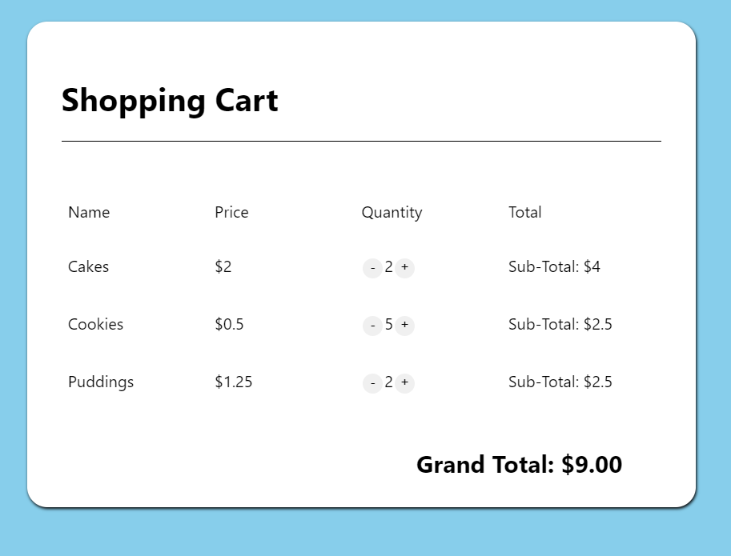

## Shopping-Cart-App

This is a simple app that emulates the behavior of an online shopping cart. It stores data into the local storage of the user in order to retain data after refreshing. The app has been created in a way that makes it easy to add an API and use in other web applications.
It is also hosted through Firebase at https://shopping-cart-9e719.web.app/.

This project was bootstrapped with [Create React App](https://github.com/facebook/create-react-app). If you'd like a tutorial on how to make a similar app and also learn about React (with Hooks) then follow Colt Steele's [video](https://www.youtube.com/watch?v=9U3IhLAnSxM). 

### `npm start`

Runs the app in the development mode. 
Open [http://localhost:3000](http://localhost:3000) to view it in the browser.

The page will reload if you make edits. 
You will also see any lint errors in the console.

